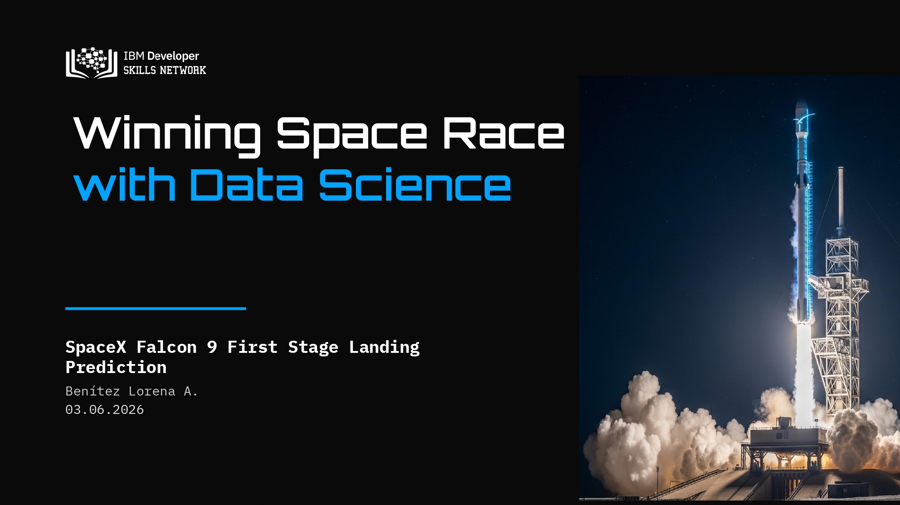
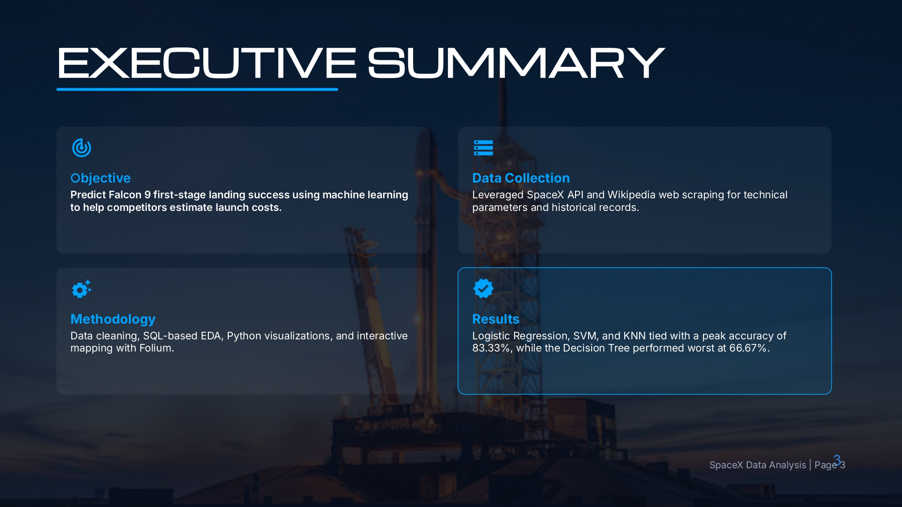

# 🚀 SpaceX Falcon 9 Landing Prediction & Analytics

Welcome to the **SpaceX Falcon 9 First Stage Landing Prediction Project**, completed as part of the **IBM Data Science Professional Certificate**. 

This project applies data science methodologies—from web scraping and exploratory data analysis (EDA) to interactive visualization and machine learning—to predict whether the Falcon 9 first stage will land successfully.

---

##  Executive Summary & Business Objective

SpaceX advertises Falcon 9 rocket launches on its website with a cost of **62 million dollars**, while other providers cost upward of **165 million dollars** each. Much of the savings is due to SpaceX's ability to reuse the first stage. 

By predicting if the first stage will land, we can determine the actual cost of a launch. This information can be used by competing commercial companies to bid against SpaceX for a rocket launch.

---

##  Tech Stack & Skills Applied

* **Programming Language:** Python 3.x
* **Data Extraction & Hygiene:** `BeautifulSoup` (Web Scraping), `REST APIs` (SpaceX API), `Pandas`, `NumPy`
* **Exploratory Data Analysis:** SQL (SQLite / PostgreSQL), `Matplotlib`, `Seaborn`
* **Interactive Data Visualization:** `Folium` (Geospatial Analysis), `Dash` / `Plotly` (Interactive Dashboard)
* **Machine Learning & Modeling:** `Scikit-Learn` (Logistic Regression, SVM, Decision Trees, K-Nearest Neighbors), `GridSearchCV` for hyperparameter tuning.

---

##  Presentation & Final Report

Below are the key slides from the executive presentation detailing the methodology, data insights, model performance metrics, and final business conclusions:

> *Note: You can explore all project assets and code notebooks directly within this repository.*

---

##  Key Results & Model Performance

* **Classification Performance:** Multiple classification algorithms were trained and evaluated using cross-validation.
* **Top Performing Model:** Decision Tree and Logistic Regression models achieved high accuracy in predicting first-stage reusability based on payload mass, orbit type, and launch site location.
